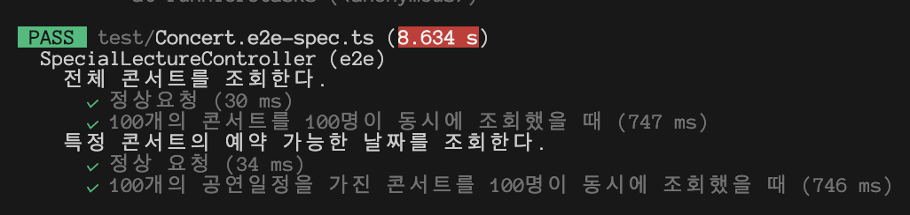
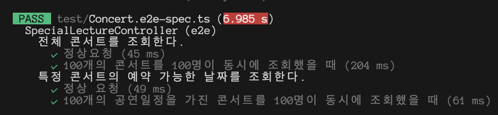
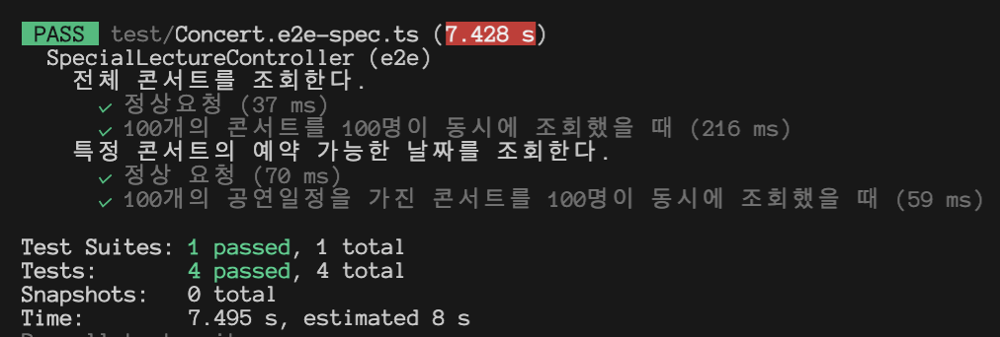

## 캐싱 할 수 있는 데이터

[ 전체 콘서트 조회 / 특정 콘서트 조회 ]

1. 변동이 크지 않는 데이터 라는 점
2. 전체 콘서트 조회 같은 경우, 여러 요청이 한번에 들어 올 수 있어 부하가 걸릴 수 있다는 점

위와 같은 이유로 캐싱할 수 있는 데이터라고 생각 하였습니다.

### 레디스 사용 전

- 전체 콘서트 조회 / 특정 콘서트 조회 API 모두 많은 데이터를 가지고 있고 많은 요청이 들어왔을 때, 시간이 오래 걸린다는 점을 알 수 있습니다.

### 레디스 사용 후 (interceptor)

- 장점
  1. 실행시간을 줄일 수 있다.
  2. 정해진 캐시 시간 동안 조금의 수정/변화도 없다는 것이 확실해지면 좋을 수 있을 거 같다.
- 단점
  1. 해당 API 에서 사용하는 service를 재사용하는 경우 캐시되지 않은 값을 받아 사용하여 간극이 생길 수 있다.
  2. interceptor에서 가로 채서 캐시 값을 반환하기 때문에 해당 API 에서 logging을 했을 경우, 수집되지 않는다.

### 레디스 사용 후 (repository / service)

- 장점
  1. 실행시간을 줄일 수 있다.
- 단점
  1. 해당 repository impl를 여러 곳에서 사용하는 경우 간극이 생기지 않도록 조심하여야 한다. (cache를 잘 관리 해야한다!)

## 대기열 -> 레디스로 이관

### 기존 대기열 문제점

- 사용자의 활성화 여부, 대기열 등록, 활성화 -> 만료 -> 활성화 (스케줄러) 같은 대기열에 관련된 액션이 많아 모두 DB를 사용하게 되면 DB에도 부하가 일어날 가능성이 높음
- 사용자 측면에서도 대기해야하는 시간이 길어져 경험 측면에서 좋지 않음
- 대기열 순번 조회를 하게 된다면 복잡한 연산을 하게 되어야 함

### 레디스 사용 시 개선 사항

- Redis는 모든 데이터를 메모리에 저장하고 조회하는 in-memory DB이기에 DB와 소통하는 거 보다 속도 측면에서 엄청난 장점
- DB 부하를 줄일 수 있어 성능 개선에도 도움이 되어 사용자 측면에서도 대기해야 하는 시간이 길어지지 않아 경험 측면에서 개선됨
- 대기열 순번 조회를 하게 된다면 redis에서 제공하는 Sorted Set(Sorted Set) 데이터 구조에서 쉽게 연산 할 수 있음
- 토큰 만료 로직을 따로 두지 않아도 TTL로 토큰 관리 가능 (관리포인트가 줄어듦)
