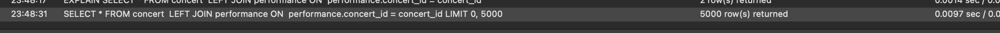

## 캐싱 할 수 있는 데이터

[ 전체 콘서트 조회 / 특정 콘서트 조회 ]

1. 변동이 크지 않는 데이터 라는 점
2. 전체 콘서트 조회 같은 경우, 여러 요청이 한번에 들어 올 수 있어 부하가 걸릴 수 있다는 점

위와 같은 이유로 캐싱할 수 있는 데이터라고 생각 하였습니다.

### 레디스 사용 전

- 전체 콘서트 조회 / 특정 콘서트 조회 API 모두 많은 데이터를 가지고 있고 많은 요청이 들어왔을 때, 시간이 오래 걸린다는 점을 알 수 있습니다.

### 레디스 사용 후 (interceptor)

- 장점
  1. 실행시간을 줄일 수 있다.
  2. 정해진 캐시 시간 동안 조금의 수정/변화도 없다는 것이 확실해지면 좋을 수 있을 거 같다.
- 단점
  1. 해당 API 에서 사용하는 service를 재사용하는 경우 캐시되지 않은 값을 받아 사용하여 간극이 생길 수 있다.
  2. interceptor에서 가로 채서 캐시 값을 반환하기 때문에 해당 API 에서 logging을 했을 경우, 수집되지 않는다.

### 레디스 사용 후 (repository / service)

- 장점
  1. 실행시간을 줄일 수 있다.
- 단점
  1. 해당 repository impl를 여러 곳에서 사용하는 경우 간극이 생기지 않도록 조심하여야 한다. (cache를 잘 관리 해야한다!)

## 대기열 -> 레디스로 이관

### 기존 대기열 문제점

- 사용자의 활성화 여부, 대기열 등록, 활성화 -> 만료 -> 활성화 (스케줄러) 같은 대기열에 관련된 액션이 많아 모두 DB를 사용하게 되면 DB에도 부하가 일어날 가능성이 높음
- 사용자 측면에서도 대기해야하는 시간이 길어져 경험 측면에서 좋지 않음
- 대기열 순번 조회를 하게 된다면 복잡한 연산을 하게 되어야 함

### 레디스 사용 시 개선 사항

- Redis는 모든 데이터를 메모리에 저장하고 조회하는 in-memory DB이기에 DB와 소통하는 거 보다 속도 측면에서 엄청난 장점
- DB 부하를 줄일 수 있어 성능 개선에도 도움이 되어 사용자 측면에서도 대기해야 하는 시간이 길어지지 않아 경험 측면에서 개선됨
- 대기열 순번 조회를 하게 된다면 redis에서 제공하는 Sorted Set(Sorted Set) 데이터 구조에서 쉽게 연산 할 수 있음
- 토큰 만료 로직을 따로 두지 않아도 TTL로 토큰 관리 가능 (관리포인트가 줄어듦)

## (8주차) 시나리오 Query 분석 및 DB Index 설계

- 가정
  - 1000 명의 user
  - 각 콘서트는 무조건 `20개의 performance`와 `100개의 seat`와 연결됨
    - 현재 콘서트 예약 가능한 콘서트 3개
      - 각 콘서트는 현재 60개씩 예약이 된 상태
    - 콘서트 예매 예정 콘서트 97 개

### 1. 전체콘서트 조회

- **AS-IS**
  - 예약 가능한 날짜를 조회 하기 위해 performance 테이블을 JOIN 하여 find 합니다.
    
  - 실행계획
    
  - 조회 시 (0.0097sec)
    
- **TO-BE**

  - concert_id index 추가
    

    - `index`를 추가하여도 계속 `FULL SCAN` 을 하는 모습
    - 데이터가 많지 않아서 옵티마이저가 full scan이 더 빠르다고 판단한 거 같습니다.
    - `index` 를 사용하지 않는 모습

    

    - `performance` 테이블에서 `concert_id`가 있는 레코드만 선택하여 `performance` 테이블의 데이터가 필터링되고 `performance` 테이블에서 매칭되는 데이터를 기준으로 결과를 필터링 → `INNER JOIN` 과 같은 역할

  - 조회 시 0.0097 sec → 0.0042 sec
    

- **결론**

  - perfomance 테이블에 concert_id 인덱스 추가

    |             | 인덱스 O | 인덱스 X |
    | ----------- | -------- | -------- |
    | 데이터 조회 | 0.0042   | 0.0097   |

### 2. 특정 콘서트 조회 By 콘서트 ID

- **AS-IS**
  - 콘서트 ID를 이용하여 해당하는 콘서트와 공연, 좌석 정보를 불러옵니다.
  - 위 분석에서 `performance` 테이블에 `concert_id` 인덱스 추가한 상태입니다.
    
  - 실행 계획
    
    - seat 테이블에서 199836 개 라는 엄청 많은 row를 조회함
    - `seat` 테이블의 `performance_id` 인덱스를 걸게 된다면 ?
  - 조회 시 (0.008sec)
    
- **TO-BE**
  - 실행 계획
    
  - 조회 시 (0.0039 sec)
    

### 3. 특정 콘서트 조회 By 좌석 ID

- 위의 분석을 토대로

  - `perfomance` 테이블에 `concert_id` 인덱스 추가
  - `seat` 테이블 `performance_id` 추가

  한 이후에 추가되어야 할 인덱스가 없는 것으로 판단하였습니다!

### 4. 특정 공연 조회 By 좌석 ID

- 위의 분석을 토대로

  - `perfomance` 테이블에 `concert_id` 인덱스 추가
  - `seat` 테이블 `performance_id` 추가

  한 이후에 추가되어야 할 인덱스가 없는 것으로 판단하였습니다!

### 5. 특정 좌석 조회 By 좌석 ID

- 위의 분석을 토대로

  - `perfomance` 테이블에 `concert_id` 인덱스 추가
  - `seat` 테이블 `performance_id` 추가

  한 이후에 추가되어야 할 인덱스가 없는 것으로 판단하였습니다!

### 6. 특정 예약 조회 By 예약 ID

- **AS-IS**
  - 예약 ID를 통해 예약 건과 예약된 좌석 정보를 조회합니다.
    
  - 실행 계획
    
  - 조회 시
    
- **결론**
  - 이미 PRIMARY key로 잘 실행이 되고 있어 인덱스를 걸지 않아도 될 거 같습니다!

## (8주차) 서비스 분리

### 서비스 분리

시나리오에 따라서 `콘서트 Service`, `예약 Service`, `결제 Service`, `포인트 Service` 로 분리 합니다.

### 예약 로직

1. 트랜잭션 시작
2. `예약 Service`에서 `콘서트 좌석 정보 요청 EVENT` 호출
3. `콘서트 좌석 정보 요청 EVENT`를 구독하고 있던 `콘서트 Service`에서 콘서트 좌석 정보 조회 후, `콘서트 좌석 정보 조회 완료 EVENT` 호출
4. `콘서트 좌석 정보 조회 완료 EVENT`를 구독하고 있던 `예약 Service`에서 콘서트 좌석 정보 확인

   a. 이미 결제된 좌석일 경우 이미 결제된 좌석 ERROR

5. 예약 정보 저장
6. `예약 Service`에서 `좌석 예약 완료 EVENT` 호출
7. `좌석 예약 완료 EVENT`를 구독하고 있던 `콘서트 Service` 에서 좌석 정보 UPDATE

   a. 좌석 정보 변경 중 오류 시 `좌석 정보 UPDATE 실패 EVENT` 호출

   b. `좌석 정보 UPDATE 실패 EVENT`를 구독하고 있던 `콘서트 Servcie` 에서 트랜잭션 rollback 실행

8. 트랜잭션 COMMIT

### 결제 로직

1. 트랜잭션 시작
2. `결제 Service`에서 `예약 정보 요청 EVENT` 를 호출한다.
3. `예약 정보 요청 EVENT`를 구독 중인 `예약 Service`에서 이벤트를 호출 받고, 예약 정보 조회 후 해당 데이터를 전달해줄 `예약 정보 조회 완료 EVENT` 를 호출한다.
4. `예약 정보 요청 완료 EVENT`를 구독 중인 `결제 Service`에서 이벤트 호출을 받고, 예약 정보를 확인한다.

   a. 결제 가능한 시간이 지났을 경우 결제 가능한 시간 초과 ERROR를 띄운다.

5. `결제 Service`에서 `포인트 차감 EVENT`를 호출한다.
6. `포인트 차감 EVENT`를 구독 중인 `포인트 Service`에서 사용자 포인트를 조회한다.

   a. 잔액 부족일 경우 `잔액 부족 EVENT`를 호출한다.

   b. `잔액 부족 EVENT`를 구독 중인 `결제 Service`에서 에러를 던진다.

7. `포인트 Service`에서 `포인트 차감 완료 EVENT`를 호출한다. 8.`포인트 차감 완료 EVENT`를 구독 중인 `결제 Service`에서 결제 완료 처리 후 정보를 저장한다.

8. 트랜잭션 COMMIT
